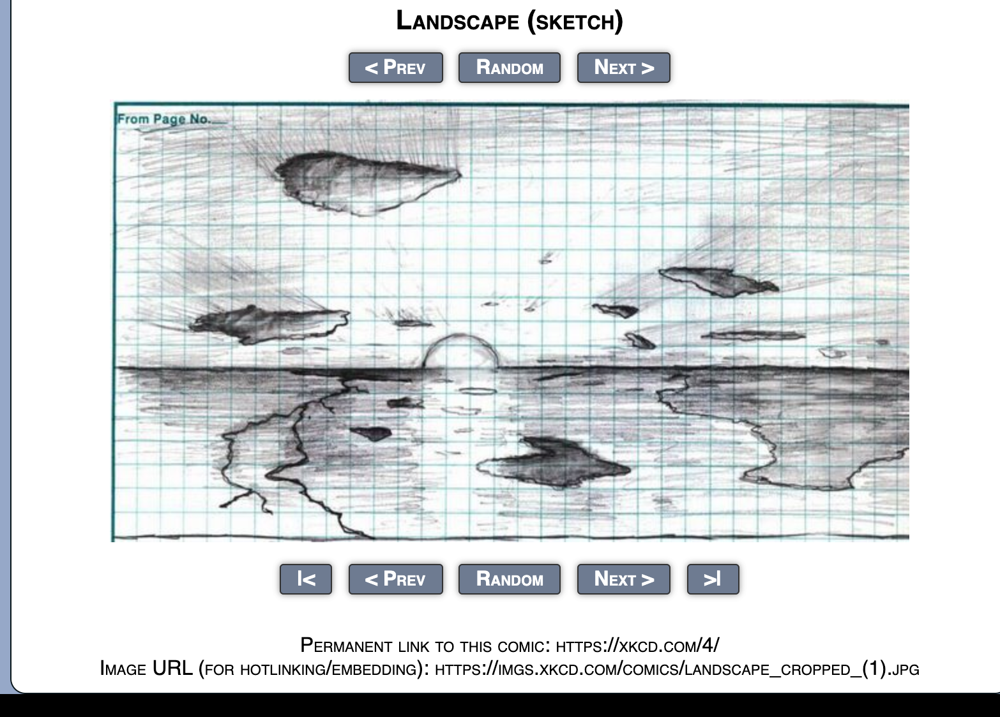
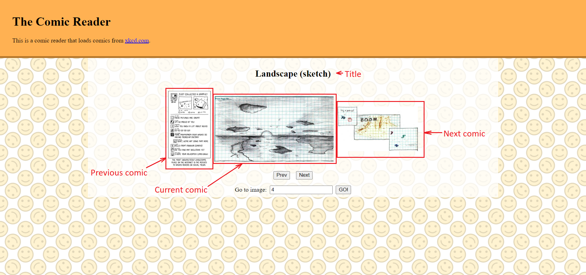

# JS Comic Project

# END OF MODULE PROJECT (CAPSTONE PROJECT)

## Briefing

### Project Title / Description:

Implement a xkcd comic reader

### Project Objective(s):

xkcd.com is a webcomic site that provides its api as documented at [https://xkcd.com/json.html](https://xkcd.com/json.html)

You can get the specific comics using the endpoints like below

- [https://xkcd.com/1/info.0.json](https://xkcd.com/1/info.0.json)
- [https://xkcd.com/600/info.0.json](https://xkcd.com/600/info.0.json)
- [https://xkcd.com/2475/info.0.json](https://xkcd.com/2475/info.0.json)

**Update**: Workaround for CORS error is to use this API instead [https://xkcd.vercel.app/?comic=/1](https://xkcd.vercel.app/?comic=/1)

Create a custom website to display 3 comics with comic title, comic image, and 3 buttons above it (prev, random,next) to control what comics to show.

Something like below, with the difference that you need to show the comic before it and after it. For example if the current image is image 200, then you should show image 199 on the left and image 201 on the right. When the current image is the last image (2475), then show image 2474 on the left and image 1 on the right. When the user clicks next/prev, the comics should change to next/prev 3 comics. For instance, if the current comics are comics 1, 2, and 3, comics 4, 5, 6 should be displayed.

To provide a good user experience, show a loading indicator while you make the API calls.

A text input and a “Go” button next to it should be displayed to allow the user to go to a specific comic number. If a user enters invalid value, an error message should be shown to indicate that the number is invalid. 

A select element should be displayed to allow users to select showing 1, 3, or 5 comics at a time.

You are not allowed to use any third-party script/library for this project. Only plain JavaScript and DOM API is allowed.

### Project Duration: 

121 hours 

### Mode of Delivery: 

Group Consultation 

Group Presentation 

**Evaluator: [Stanley Nguyen](https://github.com/stanleynguyen)**

## My Implementation

### Introduction

I have done my implementation the 1990's website style. So, those people who miss those days can feel nostalgic from my website. The following concepts have been applied:

1. Async Programming 
2. IIFE 
3. Document Object Model (DOM)
4. JavaScript Data Validation
5. CSS

### Implementation 

My website is straightforward to navigate. 

1. Next button loads the next comic
2. Prev button loads the previous comic
3. GO! button jumps to the comic index given
4. Middle comic is the current, left is previous and right is next comic
5. Title of current comic is displayed on the top

The entire list cycles, so 

- After last comic, next button will load first comic
- After first comic, prev button will load last comic

The background tile is downloaded from: [https://www.123rf.com/photo_111930614_stock-vector-happy-icon-seamless-pattern-smiley-face-icon-vector-art-illustration.html](https://www.123rf.com/photo_111930614_stock-vector-happy-icon-seamless-pattern-smiley-face-icon-vector-art-illustration.html)

Then some adjustments were made in Photoshop to obtain the final image. 

Below is a screenshot showing 4th comic (same as example)

### To run

No setup is required. Simply open `index.html` in any browser and the website will do the magic for you. 

